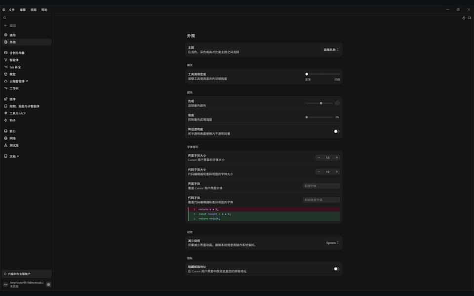
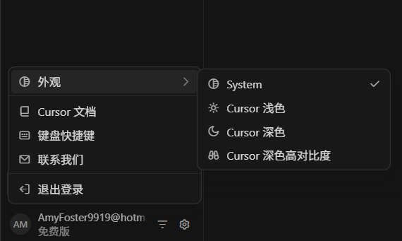
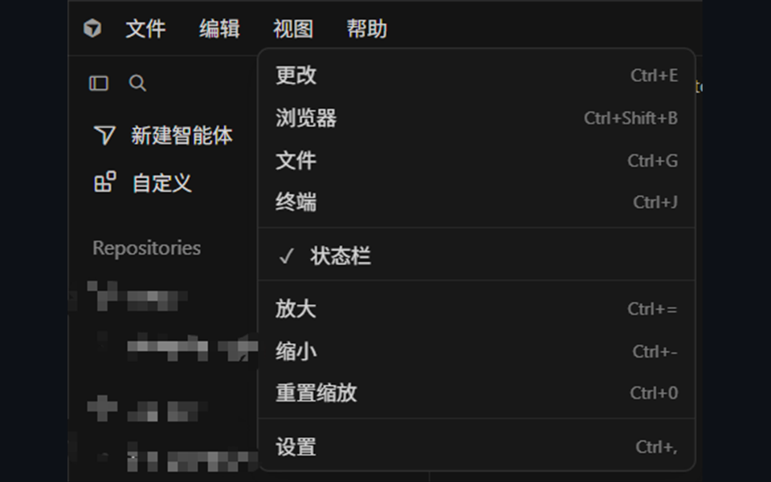
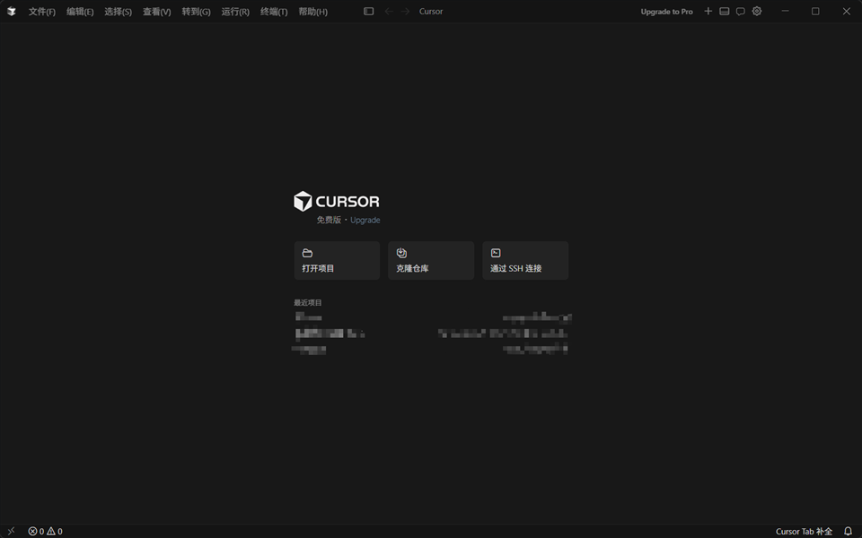

# CursorZh

<p align="center">
  <strong>Cursor 简体中文汉化补丁</strong><br/>
  适配 Cursor <code>3.5.38</code> · Editor / Agent / Settings 一键汉化
</p>

<p align="center">
  <a href="https://github.com/LRZX36/CursorZh/releases"></a>
  <a href="https://github.com/LRZX36/CursorZh/blob/main/LICENSE"></a>
  
  
</p>

---

## 效果预览

<p align="center">
  <table>
    <tr>
      <td align="center" width="420" valign="top">
        <br/>
        <sub><b>设置页</b></sub>
      </td>
      <td align="center" width="420" valign="top">
        <br/>
        <sub><b>智能体界面</b></sub>
      </td>
    </tr>
    <tr>
      <td align="center" width="420" valign="top">
        <br/>
        <sub><b>顶部菜单</b></sub>
      </td>
      <td align="center" width="420" valign="top">
        <br/>
        <sub><b>编辑器界面</b></sub>
      </td>
    </tr>
  </table>
</p>

---

## 安装前准备

1. 已安装 **Cursor 3.5.38**
2. 已安装 **Node.js 18 或更高版本**（[官网下载](https://nodejs.org/)）
3. 对 Cursor 安装目录有写入权限

常见安装路径：

| 场景 | 路径 |
|------|------|
| 自定义安装 | `D:\cursor\resources\app` |
| 默认安装 | `%LOCALAPPDATA%\Programs\cursor\resources\app` |

---

## 安装与使用

### 方式一：下载发布包（推荐）

1. 打开 [Releases](https://github.com/LRZX36/CursorZh/releases) 页面
2. 下载最新的 `CursorZh-x.x.x.zip`
3. 解压到任意目录（例如 `D:\CursorZh`）
4. 打开终端，进入解压目录后执行：

```bash
node index.js apply
```

如果自动探测不到安装路径，请手动指定：

```bash
node index.js apply --app="D:\cursor\resources\app"
```

5. **完全退出 Cursor**（托盘图标也要关掉），再重新打开

### 方式二：从源码运行

```bash
git clone https://github.com/LRZX36/CursorZh.git
cd CursorZh
node index.js apply
```

### 恢复英文原版

```bash
node index.js restore
```

---

## 覆盖范围

| 区域 | 说明 |
|------|------|
| Editor | 编辑器基础界面（基于 VS Code 中文语言包，约 89%） |
| Agent | 智能体侧栏、对话与相关提示 |
| Settings | 通用 / 外观 / 计划用量 / 智能体 / 模型 / 插件 / MCP 等设置页 |
| 菜单栏 | 文件 / 编辑 / 视图 / 帮助 等菜单项 |

品牌名、模型供应商名、模型名称等专有名词会保留英文。

---

## 常用参数

| 参数 | 说明 |
|------|------|
| `--app=<路径>` | 指定 Cursor 的 `resources/app` 目录 |
| `--skip-editor` | 跳过 Editor 汉化，只处理 Agent / Settings |
| `--skip-langpack` | 不自动安装中文语言包扩展 |
| `--force` | 当前版本不是 3.5.38 时仍强制执行 |

示例：

```bash
node index.js apply --app="D:\cursor\resources\app" --force
```

---

## 更新后怎么办

Cursor 更新可能会覆盖被修改的文件。更新完成后，在本项目目录重新执行：

```bash
node index.js apply
```

如需确认效果，可运行：

```bash
npm run verify
```

---

## 项目结构

```text
CursorZh/
├── index.js                 # 命令行入口
├── package.json
├── src/                     # 汉化引擎与词条
├── data/
│   ├── nav-snippets-*.json  # 设置侧栏导航映射
│   └── langpack/            # 中文语言包
├── scripts/                 # 维护与验收脚本
└── docs/screenshots/        # 效果截图（预留）
```

---

## 注意事项

- 本工具会修改 Cursor 安装目录中的文件，首次执行会自动备份
- 请以可写入该目录的身份运行；权限不足时可尝试管理员终端
- 本项目为非官方社区工具，与 Cursor 官方无关
- 因修改安装文件带来的风险请自行评估

---

## License

[MIT](./LICENSE)
